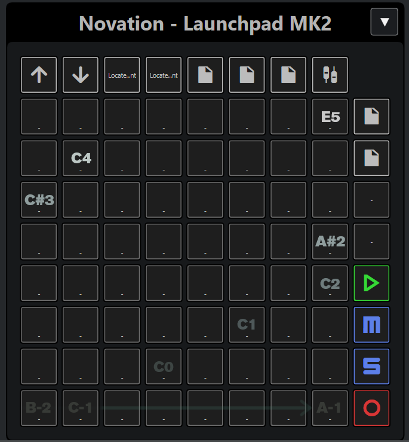
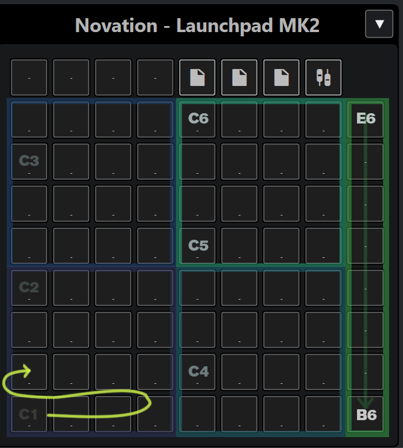

# MIDI REMOTE for Launchpad MK2 #
Simple but usable multi-page layout for the Launchpad MK2 controller.

## INTRO ##
 * **DAW**: Move between tracks (vertical) and events (horizontal)
 * **Drumpad**: Same layout as in Ableton's drum rack (4x4 groups)
 * **Volume (WIP)**: Volume faders for first eight tracks in MixConsole 

Shared: "Session", "User 1", "User 2" switch between pages and "Mixer" toggles main MixConsole.

Pad MIDI values are always 127 in DAW and Drumpad and CC between 0 and 127 in Volume page.

**NOTE** Has only be tested on Windows 10 / Cubase >=12.0.60 so far.

## INSTALL ##
- Create folder structure "Novation/Launchpad_MK2" inside "../MIDI Remote/Driver Scripts/Local" folder.
- Copy .js file inside Launchpad_MK2 folder.
- Connect your device.
- Start Cubase.

## DAW page ##

**Activation**: "Session" button.

Up and down buttons move between tracks while left and right move between events of the same track.

"Stop" toggles playback.

"Mute" and "Solo" toggle mute and solo on current track.

"Record" toggles recording on current track.

All pads mapped as semi-tones in rows from bottom left to top right with minor third jumps between rows (rightmost of one to leftmost pad of the next row).

## Drumpad page ##

**Activation**: "User1" button.

## Volume page ##

**Activation**: "Volume" button.

**WIP**: Currently only sends CC messages 21-28 with ascending values from bottom to top (0-127 in increments of 17). 

TBD:

 * visual feedback on the controller yet
 * mapping to levels of first 8 tracks

## Changelog ##

- v 0.1 17/09/2023
first release.

Programmed by Gennadij Yatksov / gennadij@yatskov.de
