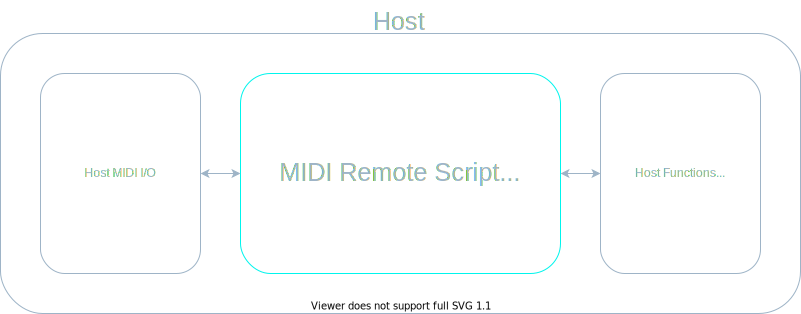
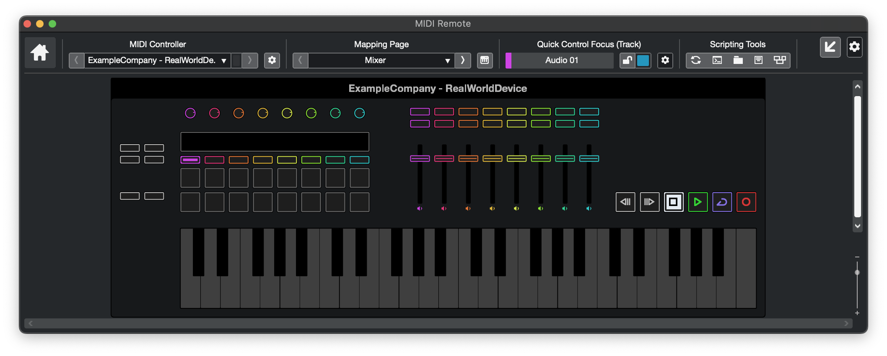
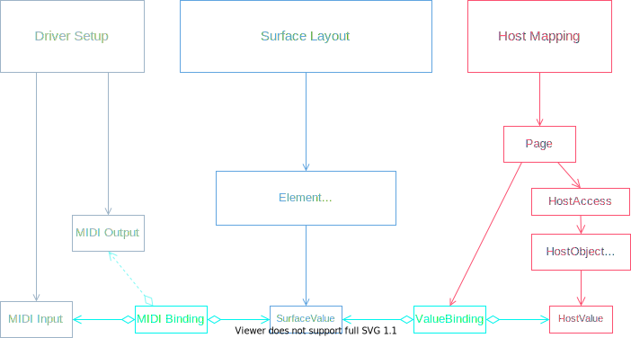
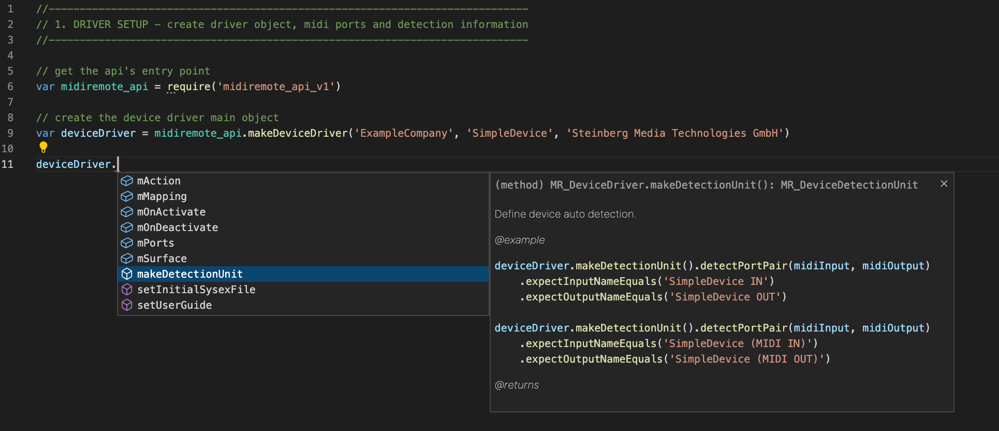
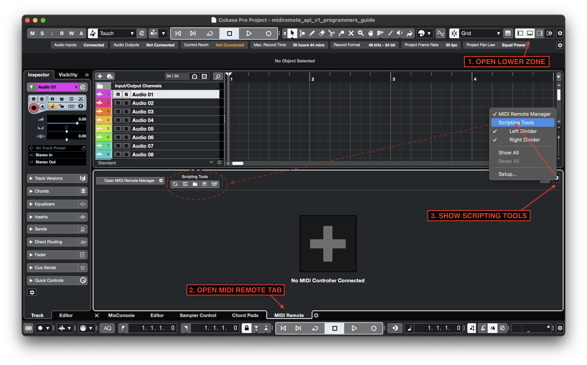
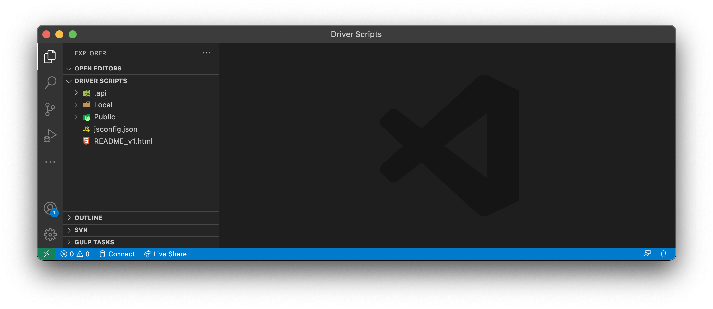
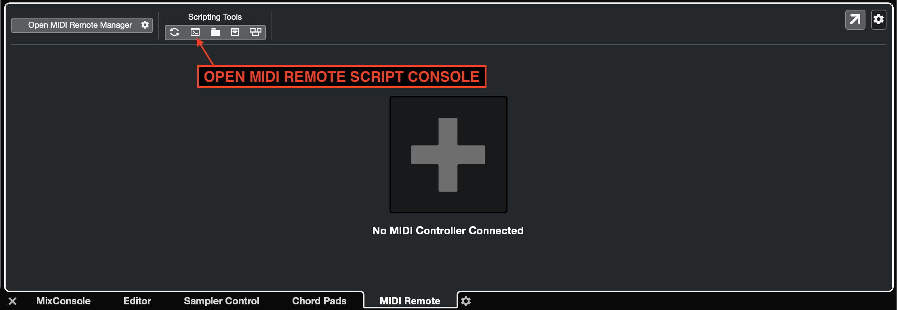
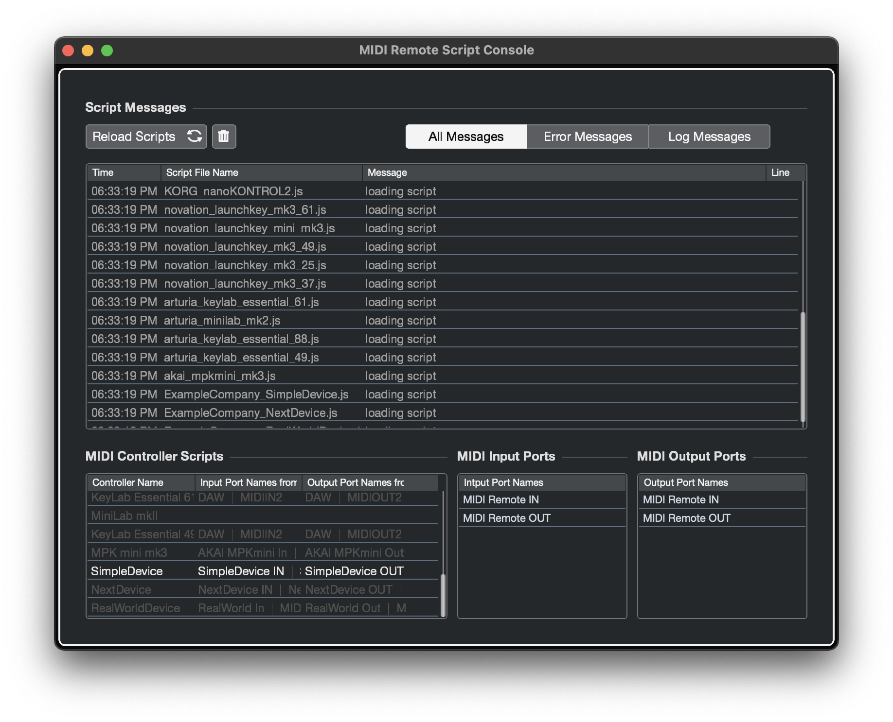

# MIDI Remote API - User Scripts

# About

Welcome to the Steinberg **MIDI Remote API**.

This document will guide you through the steps of writing a **MIDI Remote API Script** for a specific MIDI Controller Hardware.

> **NOTE**: Scripts are written in the **[ES5](https://www.w3schools.com/js/js_es5.asp)** version of **JavaScript**

# Basic Concept

> The **MIDI Remote API Script** acts as a mediator between a Hardware Controller and Cubase / Nuendo

<!-- ## Outer View -->

<!-- ## Inner View

 -->

> The **MIDI Remote API Script** emulates the hardware surface. This improves usability and recognizability.

# Script Structure

### The **MIDI Remote API Script** consists of three building blocks
1. Driver Setup
   - create driver object
   - define driver ports to be associated with existing hardware midi ports
   - specify all possible port namings for automatic device detection

2. Surface Layout
    - visualize the hardware's surface elements (e.g. knobs, faders, buttons)
    - bind surface elements to midi messages

3. Host Mapping
   - create mapping pages for each user workflow (e.g. mixing, playing instruments, track navigation)

&nbsp;

> The following image illustrates that:

&nbsp;

# Getting Started

<!-- > As IDE we recommend _Visual Studio Code_, however any IDE will do.  -->

### To get started please perform these steps:

1. Make sure you have [Visual Studio Code](https://code.visualstudio.com/) installed.

We highly recommend using <a href="https://code.visualstudio.com">Visual Studio Code</a> for writing <b>MIDI Remote API Scripts</b>. We provide a <a href="https://jsdoc.app">JSDoc</a> based auto-completion setup. You will not have to look up types and methods in a separate documentation. <a href="https://code.visualstudio.com">Visual Studio Code</a> will help you write scripts intuitively.

2. Make sure the folder of the [Visual Studio Code](https://code.visualstudio.com/) executable is added to the PATH environment variable.

3. Make sure you have the newest Cubase / Nuendo installed.

4. Start Cubase / Nuendo.

5. Create a project with audio and/or instrument tracks.

6. Open the Remote tab in the lower zone.

1. Open the **MIDI Remote Driver Scripts** folder.

> <code class="path"><b>Mac:</b> /Users/&lt;Username&gt;/Documents/Steinberg/&lt;Cubase or Nuendo&gt;/MIDI Remote/Driver Scripts</code>

> <code class="path"><b>Windows:</b> C:\Users\\&lt;Username&gt;\Documents\Steinberg\&lt;Cubase or Nuendo&gt;\MIDI Remote\Driver Scripts</code>

&nbsp;

1. Open a console (win: cmd, mac: terminal) and go to the **MIDI Remote Driver Scripts** folder.

2. Open [Visual Studio Code](https://code.visualstudio.com/) from the command line like this:

> code .

10. Create a script file.
   
The **MIDI Remote API Script** file follows the structure:
<code class="path"> &lt;Driver Scripts Folder&gt;/&lt;Local or Public&gt;/&lt;vendor&gt;/&lt;device&gt;/&lt;vendor&gt;_&lt;device&gt;.js</code>

<b>WARNING:</b> Always use the folder <b>Local</b> for development, folder <b>Public</b> will be overwritten when starting Cubase / Nuendo.

Example:
<code class="path"> &lt;Driver&nbsp;Scripts&nbsp;Folder&gt;/Local/Nektar/Impact_LX49Plus/Nektar_Impact_LX49Plus.js</code>

1.   Connect your MIDI hardware controller.

2.   Open script console.

> The **Script Console** appears like this:

> After modifying the script file press the 'Reload Scripts' button.
